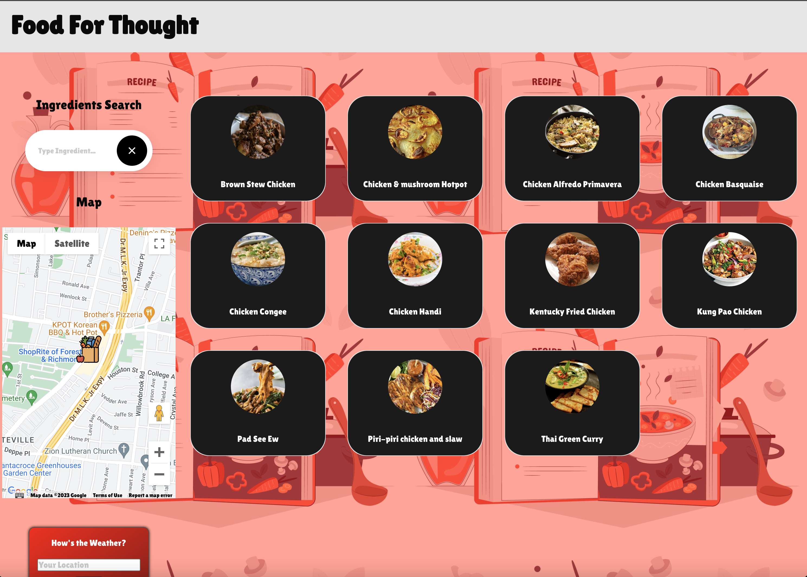

## Description

Welcome to Food For Thought, a user-friendly webpage designed to help you find the perfect recipe based on your available ingredient. Whether you are a college student, a single parent, a yuppie, a food enthusiast, or anyone else in need of culinary inspiration, this is the place for you!

## Problem/Motivation

We understand the frustration of having a single ingredient and not knowing what to make with it. That's why Food for thought is here to save the day! Our platform aims to address the common problem of incomplete recipes by providing a list of delectable options that you can whip up using the ingredient you have on hand. Additionally, we make it convenient for you by showing nearby grocery stores where you can purchase any additional items you might need.

## How Recipe Finder Addresses the Problem

Food For Thought offers a simple and intuitive interface to streamline your recipe search process. Here's how it works:

1.Ingredient Selection: Start by entering the single ingredient you have. It could be anything from a vegetable to a protein, a pantry staple to a unique spice. Our advanced algorithms will process your selection and generate a range of recipe options that incorporate your chosen ingredient.

2.Recipe Options: Once you've submitted your ingredient, Recipe Finder will display a curated list of recipes that make the most of your selection. Each recipe comes with a captivating image, a tantalizing description, and a list of required ingredients (including your selected ingredient). You'll also find detailed step-by-step instructions on how to prepare each dish.

3.Grocery Store Locator: Alongside the recipes, we provide a helpful map feature that shows nearby grocery stores in your area. This way, you can quickly find the closest location to pick up any missing ingredients and start cooking right away.

## Installation

N/A

## App link

https://danielg808.github.io/food-for-thought/

## User Interaction

1.On the homepage, users are greeted with a clean and welcoming interface. A prominently displayed search bar encourages them to enter their ingredient.

2.After entering the ingredient, users can click on the "Ingredients Search" button to initiate the search.

3.The webpage then displays a visually appealing list of recipe options, each presented in a card format. Users can scroll through the options and click on any recipe card to view more details.

4.Within the recipe view, users can read the recipe description, view the required ingredients, and access the step-by-step instructions. They also have the option to share the recipe on social media or save it for future reference.

5.To explore nearby grocery stores, users can enable Google map to automatically look up nearest grocery stores. Also an integrated map icon. This opens a map view with pinned locations of grocery stores in their vicinity.

6.Users can interact with the map to zoom in/out, click on pins for more information, or get directions to the desired grocery store.

## Credits

Aurora Stone

Daniel Gray

Tega Omarejedje

Christopher Lee

Sameer Mirza

## License

MIT license
